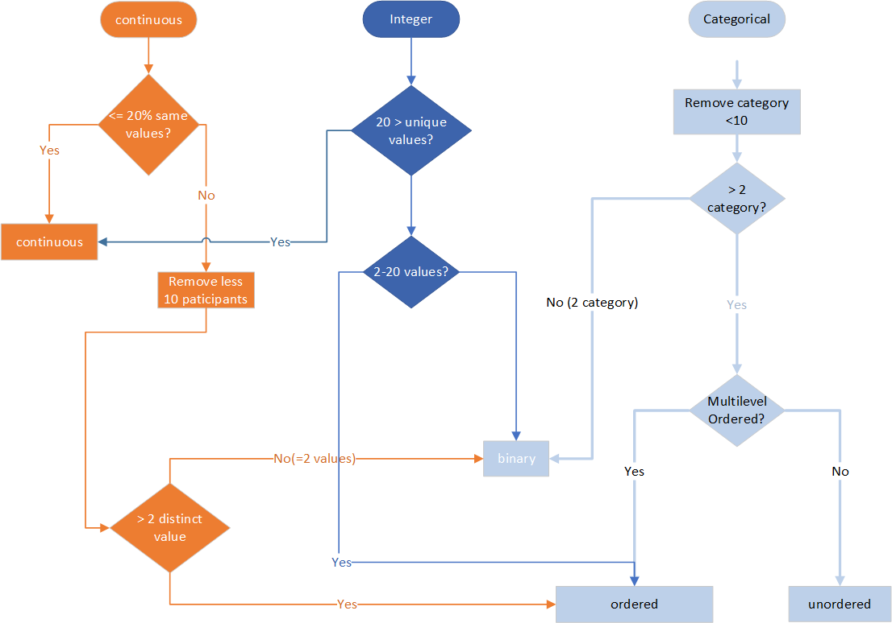

```{r, include = FALSE}
knitr::opts_chunk$set(
  collapse = TRUE,
  comment = "#>"
)
```

```{r setup}
library(phonto)
library(DT)
```

### Describe NHANES and our data

[National Health and Nutrition Examination Survey （NHANES)](https://www.cdc.gov/nchs/nhanes/index.htm) datasets are collected from the Centers for Disease Control and Prevention in the USA, including demographics, dietary, laboratory, examination, and questionnaire data. 

The survey is carried out in two year "epochs" from 1999-2000 to 2017-2018, and that within an epoch the same people are generally surveyed. However, not all of participates in all of the components (i.e demographics, dietary, laboratory, examination, and questionnaire) of the survey.  


<FONT COLOR="RED"> RG: But, importantly, there are no people that span two (or more epochs), so any joins have to be within a 2 year epoch. </FONT>

<FONT COLOR="BLUE"> Laha: Actually, is it possible that people may assigned new SEQNs in different "epochs"? do we know about that?*** </FONT>

  <FONT COLOR="RED"> RG Within each survey epoch the data are organized in named tables (you can outline the notion of the SAS name, the short variable name, the longer name and so on). </FONT>\
  
<FONT COLOR="BLUE"> Laha: We do not have the SAS names in the database for now. I can copy them from the website, but I think we want to a function to retrieve those information from the database. </FONT>
 
 
Although we can download NHANES data from [its website](https://www.cdc.gov/nchs/nhanes/index.htm), it is pretty inconvenient to manipulate data in such a way. For example, one could search variables in body measurements and demographics data from the year 1999 to 2006. It would take a significant amount of time to download and put such data together. Another more challenging issue is that researchers may want to search for certain data containing a specific variable. For instance, one might want to know if data files contain variable URXDAZ - Daidzein (ng/mL) and load all the data to further analysis; it would be not only extremely inconvenient to download all the files and search them but also possible that we may miss some of the data if we do it manually. 

In this notebook, we demonstrate the data manipulation with our R functions to show how those functions can help us in our work. 

### 1. searchTableByName()

searchTableByName(): can search the tables by the name patterns, and it returns a data frame of the results, which contains the questionnaire (the table names provided in NHANES websites), a long descriptive table name (eg.BloodPressure) and the survey years. 

More information about the function check the help document for the function by

`> ?searchTableByName`

```{r}
res = searchTableByName("BPX")
datatable(res)
```
The above search result includes the table BloodPressureOscillometricMeasurements, which may not want what we want. We can replace the search pattern "BPX" with "BPX[_]," which matches only the table containing the string "BPX_"; therefore, the "BPXO_J" will be excluded. t the BPX table with no undescore.  You must put yourself into the frame of mind of the naive user and explain things is great detail here.
```{r}
res = searchTableByName("BPX[_]")
datatable(res)
```

# 2. unionQuery()
The unionQuery() function, table list of table name and a set of column names, it combines the researched results and returns the results as a data frame.

More information about the function check the help document for the function by

`> ?unionQuery`

```{r search_union,warning=FALSE,message=FALSE}
tablnames = searchTableByName('BPX[_]')
blood_df <- unionQuery(tablnames$TableName,cols =c("BPXDI1","BPXDI2","BPXSY1","BPXSY2"))
DT::datatable(blood_df)
```

## 3. jointQuery()
The jointQuery() function, table list of table name and a set of column names, it merges the researched results and returns the results as a data frame.

More information about the function check the help document for the function by

`> ?jointQuery`

```{r}
tables <- c("DemographicVariablesAndSampleWeights","BloodPressure")
cols <- c("RIDAGEYR","RIAGENDR","RIDRETH1","DMDEDUC2","years","BPXDI1","BPXDI2","BPXSY1","BPXSY2")
data <- jointQuery(tables,cols)
datatable(data)
```

### 4. PHESANT-like

We can run the PHESANT-like process to convert each column into data types. It also provides the ratio of unique values (`r_unique`), the proportion of zeros (`r_zeros`), and the ratio of NAs (`r_NAs`), which is calculated by the number of unique values, zeros, and NAs divided by total records. The categorical data types (ordered or unrecorded) are presented by integers, and the PHESANT function category them as multilevel. For example, education (DMDEDUC2) is category as Multilevel-7 means the PHESANT process considers it multilevel and has 7 levels.

```{r}
phs_dat = phesant(data)
data = phs_dat$data
DT::datatable(phs_dat$phs_res)
```

### 5.Setup factor levels for catigorycial varaibles

Categorical variables are presented with integers as shown below.

```{r}
data[,c('RIAGENDR', 'RIDRETH1','DMDEDUC2')] |> head() |> knitr::kable()
```
The real factor levels can be set with nhanesTranslate() functions from nhanesA package as shown below.

```{r}
data = nhanesA::nhanesTranslate('DEMO_D', c('RIAGENDR', 'RIDRETH1','DMDEDUC2'), data=data[1:1000,])
# head(data)
datatable(data[,c('SEQN','RIAGENDR', 'RIDRETH1','DMDEDUC2')])
```

##FIXME: Laha - somewhere you should have an explicit definition of what is in the code - what makes something continuous - what makesit discrete, what makes it ordered? In the first pass, all the categorical values are discrete integers - that does not make them ordered - you have to look at the actual levels - and we need to explain how our users will do that.


##FIXME - the more I think about it, we should only report a factor, if the column has been transformed into an R factor, and then you can get from that whether it is ordered or unordered.  When you get a column with integer values only (and less than whatever the PHESANT cut-off is, then call them "categorical" - let's reserve the label "factor" for R factors.

Currently, we are doing as the following flow chat, but both the ordered and unordered are considered as multilevel.
{width=80%}

