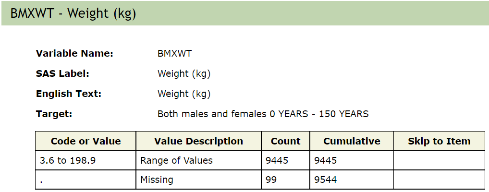
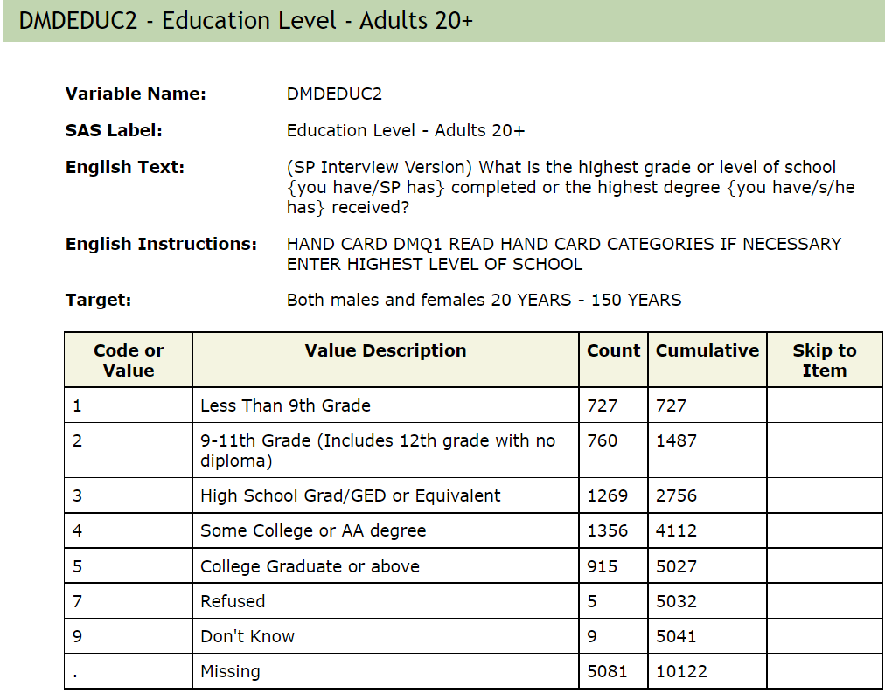

```{r, include = FALSE}
knitr::opts_chunk$set(
  collapse = TRUE,
  comment = "#>"
)
```

```{r setup}
library(phonto)
library(DT)
```

### NHANES 

The [National Health and Nutrition Examination Survey （NHANES)](https://www.cdc.gov/nchs/nhanes/index.htm) datasets are collected from the Centers for Disease Control and Prevention in the USA, including demographics, dietary, laboratory, examination, and questionnaire data. The five publicly available data categories are: - Demographics (DEMO) - Dietary (DIET) - Examination (EXAM) - Laboratory (LAB) - Questionnaire (Q). The abbreviated forms in parentheses may be substituted for the long form in nhanesA commands. There is also limited access data, eg. genetics, that requires written justification and prior approval before users are granted access. We restrict our tools to the publicly available data.

The survey is carried out in two year "epochs" from 1999-2000 to 2017-2018, and that within an epoch a set of people are surveyed. However, not all of the participants are surveyed for all of the components. Within each of the data categories NHANES has organized the data in Questionnaires and provides web interfaces to descriptions of the contents of each questionnaire.  We do not replicate the web interface, users can browse that information using standard tools, but we have constructed an integrated SQL database representation of much of the publicly available NHANES data.  There are many advantages to placing all the data into one database as that facilitates searching and extraction of relevant values.

Each participant is assigned a unique ID and that is stored in the database as \texttt{SEQN} which is then used as a primary key. Any merging of data extracted from different tables should be based on \texttt{SEQN}. 
Within each of the two-year epochs NHANES has produced a set of tables, or data files. One example is the [Body Measures](https://wwwn.cdc.gov/nchs/nhanes/2001-2002/BMX_B.htm)
table, which provides data from the 2001-2002 surveys. The web page provides details on the measurements and how they are recorded.
Here two examples:
{width=80%}
{width=80%}

Users familiar with SQL can connect and explore the data with database client tools such as HeidiSQL and DataGrip, or programming languages. In the [example](https://github.com/ccb-hms/NHANES/blob/main/Code/R/regressionExample.R), we show using R connect to the database and get access to data and sample analysis. In addition, we also wrapped some functions for users to get access to the data easily, the function can be see in [phonto package](https://github.com/ccb-hms/phonto/tree/main/vignettes).


  <FONT COLOR="RED"> RG Within each survey epoch the data are organized in named tables (you can outline the notion of the Questionnaire
 name, vs Nathan's scheme for longer names). Refer to the example below in searchTableByName </FONT>
  

The CDC provides substantial [web-based tools](https://www.cdc.gov/nchs/nhanes/index.htm) for investigating the data and metadata has produced an R package called nhanesA([Endres et. al](https://cran.r-project.org/web/packages/nhanesA/index.html)). Most of the data collected can easily be downloaded from the CDC website, however accessing the data in that way can be problematic and error prone. nhanesA package provides a set of tools to search and download the data and metadata, which makes the data more accessible to the users. However, the function needs to access the NHANES website every time the user calls the R function, which leads to slow getting data and raises errors occasionally due to network issues.

In the spirit of producing more easily reproduced and shared analyses we have created a SQL database in a Docker (cite Docker) container that contains most of the available data.  Around that SQL database we have constructed a number of R packages and other tools that help scientists analyze the data. Since all of the code and data are under version control, anyone can obtain the same version of the data and code and get identical results.  


In this notebook, we demonstrate the data manipulation with our R functions to show how those functions can help us in our work. 

We can load the data if we know which data file we want to load by using nhanes() function. Otherwise, we can retrieve the data as following steps
- search the tables/data files though variable names or tables names
- load the data with unionQuery or jointQuery

### 0. We might want to outline some search strategies.
How do i find out about variables that encode Height information?  Can you run through a set of commands that would get someone
information about which tables they are in, then use that to get a data frame with height in it?

NHANES surveys are organized in two-year intervals, starting with 1999-2000.
There are five publicly available data categories: - Demographics (DEMO) - Dietary (DIET) - Examination (EXAM) - Laboratory (LAB) - Questionnaire (Q). The abbreviated forms in parentheses may be substituted for the long form in nhanesA commands.
When querying the database you can restrict by type of data category and by year (as well as other options).

### 1. nhanesTables()
  This function wil list all the tables
 
### 1.1 searchTableByName()

This function lets users search for tables in the database by the table name, which can be either the short names used by NHANES or the 
longer descriptive names.  For our Dockerized container no restricted data can be accessed (ie the RDC tables are excluded) and the includerdc option is not supported.

 <FONT COLOR="RED"> FIXME: is this correct Laha? If so can you add something to the man page to show this and an example of using
the long descriptive names - also the man page says: includerdc: If TRUE then RDC only tables are included (default=FALSE).
but what is an RDC table? can you explain on the man page? searchTableByName(): can search the tables by the name patterns, and it returns a data frame of the results, which contains the questionnaire (the table names provided in NHANES websites), a longer descriptive table name (eg.BloodPressure) and the survey years. </FONT>

 <FONT COLOR="blue">No, it does not support search the long tale name, it was designed for search short table names as the nhanesA package does. But I can added it if that is what we want.</FONT>


For example, we can search blood pressure related table by the following code. We choose "BPX" as the parameters based the CDC table name conventions. The users can pass more sophistic search patterns according "LIKE string" in sql Server, more details can be found [here](https://learn.microsoft.com/en-us/sql/t-sql/language-elements/like-transact-sql?view=sql-server-ver16).
```{r}
res = searchTableByName("BPX")
datatable(res)
```
In the research data frame, Questionnaire present CDC tables, and TableName present long descriptive names which hold the data across the years.


##FIXME: this is where you probably need to update a man page for searchTableByName - as you will have to point out that the
"BPX[_]" string is passed to the database engine directly.  As I was trying to suggest above, you have to consider things from the
naive users point of view.  They don't know that there is a SQL database in the backend and they need some help to understand how
the table name argument is used here.  I am not sure they would understand the description you have below.

The above search result includes the table BloodPressureOscillometricMeasurements, and a different kind of measurements of blood pressures, which may not want what we want. Then, we can replace the search pattern "BPX" with "BPX[_]," which matches only the table containing the string "BPX_"; therefore, the table named "BPXO_J" will not match the search string and hence won't be returned
as an option. But, the table named "BPX" also has no underscore and it also will not match. FIXME: this next sentence is encouraging you - Laha:  You must put yourself into the frame of mind of the naive user and explain things in great detail here.
```{r}
res = searchTableByName("BPX[_]")
datatable(res)
```

# 1.2 Searching for Variables
 One of the main challenges in using the NHANES data set is finding the tables that contain 
 the data you want to analyze.  In this section we outline some of the basic methods you can use to do the searching. Suppose we wanted to find variables that had LDL (low density lipoproteins).  To do that we use the nhanesSearch function.
```{r}
s1 = nhanesSearch("LDL")
LDLTabs = searchTablesByVar('LBDLDL')
```
 
 
# 2. unionQuery()

The unionQuery() function is designed to aggregate data across the years. Tt aggregate the researched results and returns the results as a data frame. For example, the blood pressure tables in CDC are BPX, BPX_B,...BPX_J from years 1999-2000 to 2017-2018. The users can aggregate some or all of the data.

##FIXME - here we disagree - I think this function is designed to aggregate data, within a table, across years - you might need to explain how the BPX type tables differ across years - but if we want blood pressure for everyone over the whole range of the study we need to somehow query across the set of tables.  
##FIXME: we do that for different (maybe they are conceptual tables) - and maybe we need to explain that more up at the top.  Again you could start by saying that they measured blood pressure every epoch, that's how you get the tables BPX,...BPX_J.  Maybe you show that they didn't measure all the same things every survey.  Maybe you explain that BPXO_J is another way of measuring blood pressure.


```{r search_union,warning=FALSE,message=FALSE}
tablenames = searchTableByName('BPX[_]')
blood_df <- unionQuery(tablenames$TableName,cols =c("BPXDI1","BPXDI2","BPXSY1","BPXSY2"))
DT::datatable(blood_df[1:400,])
```

## 3. jointQuery()
The jointQuery() function, table list of table name and a set of column names, it merges the researched results and returns the results as a data frame. The data are joined using SEQN which is the unique identifier for individuals.
#FIXME: ok this one is more interesting - but you need to perhaps explain that SEQN is the primary key in this database and that jointQuery is going to merge on that quantity.  And this might be where you want to be clear that SEQNs are unique to epochs - they don't appear in more than one, and even if it was the same person there is no way to know that.

The function supports using either Questionnaire names or the long descriptive name like
DemographicVariablesAndSampleWeights.
```{r}
tables <- c("DemographicVariablesAndSampleWeights","BloodPressure") 
cols <- c("RIDAGEYR","RIAGENDR","RIDRETH1","DMDEDUC2","years","BPXDI1","BPXDI2","BPXSY1","BPXSY2")
data <- jointQuery(tables,cols)
tdata = data[1:100,]
DT::datatable(tdata)
```

```{r}
tables <- c("DEMO_C","BPX_C") 
cols <- c("RIDAGEYR","RIAGENDR","RIDRETH1","DMDEDUC2","years","BPXDI1","BPXDI2","BPXSY1","BPXSY2")
data <- jointQuery(tables,cols)
tdata = data[1:100,]
datatable(tdata)
```


### 4. PHESANT-like

We can run the PHESANT-like process to convert each column into data types. It also provides the ratio of unique values (`r_unique`), the proportion of zeros (`r_zeros`), and the ratio of NAs (`r_NAs`), which is calculated by the number of unique values, zeros, and NAs divided by total records. The categorical data types (ordered or unrecorded) are presented by integers, and the PHESANT function category them as multilevel. For example, education (DMDEDUC2) is category as Multilevel-7 means the PHESANT process considers it multilevel and has 7 levels.

##FIXME: in phonto - you should say something like raw values for factor like things (some number of levels are first called multi-level data and then once they have been made into R factors, the table output will reflect that).

```{r}
phs_dat = phesant(data)
data = phs_dat$data
DT::datatable(phs_dat$phs_res)
```

### 5.Setup factor levels for categorical variables

In the raw NHANES data stored in the database all categorical variables are represented as integers.  In order to make use of these for 
analysis you will need to transform them into factors in R.  It is important that you get these right and at that point we 
really want to help them do some checking - 

Categorical variables are presented with integers as shown below.

```{r}
data[,c('RIAGENDR', 'RIDRETH1','DMDEDUC2')] |> head() |> knitr::kable()
```
And the real factor levels for year 2003-2004 can be found in [the cookbook]() as shown below.





The real factor levels can be set with nhanesTranslate() function.

```{r,DT.warn.size=FALSE}
#data = phonto::nhanes("DEMO_C")
data = phonto::nhanesTranslate('DEMO_C', c('RIAGENDR', 'RIDRETH1'), data=TRUE)
# head(data)
datatable(data[1:100,c('SEQN','RIDAGEYR','RIAGENDR', 'RIDRETH1')] )

#  We can  also  check the the variables  code  and values:
# phonto::nhanesTranslate('DEMO_C', c('RIAGENDR','RIDRETH1'))
```

##FIXME: Laha - somewhere you should have an explicit definition of what is in the code - what makes something continuous - what makesit discrete, what makes it ordered? In the first pass, all the categorical values are discrete integers - that does not make them ordered - you have to look at the actual levels - and we need to explain how our users will do that.


##FIXME - the more I think about it, we should only report a factor, if the column has been transformed into an R factor, and then you can get from that whether it is ordered or unordered.  When you get a column with integer values only (and less than whatever the PHESANT cut-off is, then call them "categorical" - let's reserve the label "factor" for R factors.

Currently, we are doing as the following flow chat, but both the ordered and unordered are considered as multilevel.
{width=80%}

