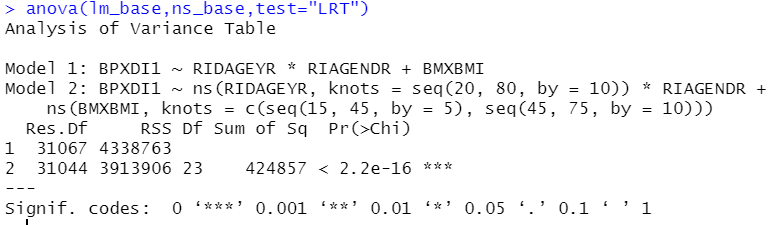
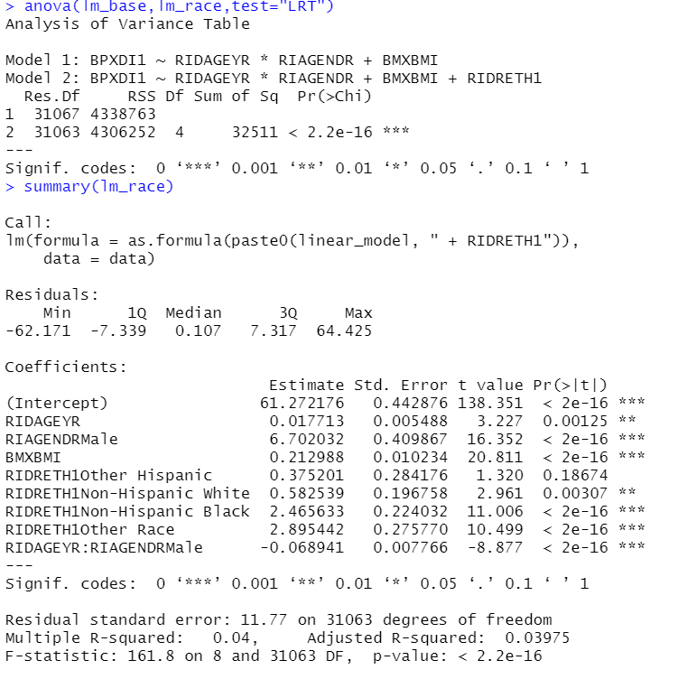

```{r setup, include=FALSE}
knitr::opts_chunk$set(echo = TRUE)
```


## Load libs and Load data
The process of load libs and data is the same as [EnWAS sample](https://ccb-hms.github.io/Imputation/7_enwas/EnWAS_simple.html).

```{r data, warning=FALSE,message=FALSE,echo=FALSE}
# source("../6_nhanes_data/phesant.R")

library(DBI)
# library(broom)
library(splines)
# library(stringr)
library(dplyr)
library(ggplot2)
library(EnWAS)
library(Hmisc)

exposure_vars <-
  read.delim("../../data/select_vars.txt", header = FALSE)$V1
exposure_cols <- paste(exposure_vars, collapse = ", ")


# Load data and convert data types according to PHESEANT.
# Return data set and PHESEANT results.
load_data <- function(exposure_cols) {
  nhanes_db <- dbConnect(RSQLite::SQLite(), "../../nhanes.sqlite")

  
  cols <-
    'SEQN,BMXWAIST, RIDAGEYR, BMXHT, BMXBMI, BMXWT, RIAGENDR,SDMVPSU,SDMVSTRA,RIDRETH1, INDFMPIR, years,'
  data_sql <-
    paste('SELECT', cols, exposure_cols, 'FROM merged_table')
  
  data <- dbGetQuery(nhanes_db, data_sql)
  data <- na.omit(data)
  dbDisconnect(nhanes_db)
  
  data
  
}

nhanes_data <- load_data(exposure_cols) 
data_phs <- phesant(nhanes_data)

data <- data_phs$data
phs_res <- data_phs$data_types

```

## Query Extra data 
This part loads the blood pressure data and merges it with the dietary and demographic data in the above section.

```{r query, echo=TRUE}
set.seed(123)
nhanes_db <- dbConnect(RSQLite::SQLite(), "../../nhanes.sqlite")
# demo <- dbGetQuery(nhanes_db, "select * from demo")
# cholesterol <- dbGetQuery(nhanes_db, "select * from cholesterol")
# BPXDI2,BPXSY1
blood_pressure <- dbGetQuery(nhanes_db, "select SEQN,BPXDI1,years from blood_pressure where BPXDI1 IS NOT NULL and BPXDI1 <> 0")
dbDisconnect(nhanes_db)
data <- merge(blood_pressure, data, by = c("SEQN",'years'))

```

## Base Model

```{r func3, echo=TRUE,warning=F, out.width = '90%'}
linear_model <- 'BPXDI1 ~ RIDAGEYR*RIAGENDR + BMXBMI'
lm_base <- lm(as.formula(linear_model), data)

all_ns_model <-
  'BPXDI1 ~ ns(RIDAGEYR, knots = seq(20, 80, by = 10)) * RIAGENDR + ns(BMXBMI,knots = c(seq(15, 45, by = 5),seq(45,75,by=10)))'
ns_base <- lm(as.formula(all_ns_model), data)
```

## Bins plot functions


```{r plot_functions, echo=TRUE,warning=FALSE,message=FALSE,results = "asis"}
library(ggpubr)
library(reshape)
make_bins <- function(x,y,nbin){
  if (nbin==0)
    nbin <- floor(sqrt(length(x)))
  
  df <-
  data.frame(
    y = y,
    breaks = cut2(x,m=nbin,levels.mean=TRUE)
  )
  df <- df %>% 
  dplyr::group_by(breaks) %>% 
  dplyr::summarize(mean = mean(y),
            std = sd(y),
            cnt = n()
            ) %>% dplyr::mutate(y_min=mean-1.96*std/sqrt(cnt), y_max = mean+1.96*std/sqrt(cnt))
  
  df$breaks <- as.numeric(as.character(df$breaks))
  
  df

}

plot_bins<- function(x,y,xlab="Value",ylab="Binned Residuals",title="linear",nbin=300){

  df <- make_bins(x,y,nbin)
  g <- ggplot(df,aes(breaks,mean)) + geom_point() +
  geom_errorbar(aes(ymin=y_min,ymax=y_max))+
  geom_smooth(aes(breaks,mean),method = "lm", formula = y ~  ns(x, df=7))+
  ylab(ylab) + xlab(xlab) + labs(title = title)

 g

  
}


plot_bins2<- function(df_list,nbin=300,xlab = "Moisture",ylab = "Binned Residuals"){
  df <- do.call("rbind", df_list)
  df$Model <-
  rep(names(df_list), each = nrow(df_list[[1]]))
    
  g <- ggplot(df,aes(breaks,mean,color=Model)) + geom_point() +
    geom_errorbar(aes(ymin=y_min,ymax=y_max))+
  geom_smooth(aes(breaks,mean),se = FALSE)+
    scale_color_manual(values=c("#E69F00", "#56B4E9"))+
  ylab(ylab) + xlab(xlab) +
  theme_minimal()
  g
  
}


```


## BPXDI1 - Diastolic: Blood pres (1st rdg) mm Hg

This section compares linear and spline regression of Diastolic blood pressure against age and BMI.

```{r BPXDI1, echo=TRUE,warning=FALSE}


pred_df <- data.frame("Age"=data$RIDAGEYR,
                      "Sex"=data$RIAGENDR,
                      "BMI"=data$BMXBMI,
                      "Linear"=lm_base$fitted.values,
                      "Spline"=ns_base$fitted.values)


mpred_df <- melt(pred_df, id=c("Age","Sex",'BMI'))

raw_bmi <- ggplot(mpred_df, aes(x=BMI, y=value,colour=Sex) ) +
 geom_smooth() + geom_point(data = ~ group_by(.x, Age, Sex,variable) %>% sample_frac(0.05),alpha=0.2)+
  facet_grid(cols = vars(variable))+ ylab("Fitted Values")+ xlab("BMI (kg/m²)")+
  theme_bw()

raw_age <- ggplot(mpred_df, aes(x=Age, y=value,colour=Sex) ) +
 geom_smooth() + geom_point(data = ~ group_by(.x, Age, Sex,variable) %>% sample_frac(0.05),alpha=0.2)+
  facet_grid(cols = vars(variable))+ylab("Fitted Values")+ xlab("Age (year)")+
  theme_bw()


df_bmi_res <- list("Linear"=make_bins(x=data$BMXBMI,lm_base$residuals,nbin=600),
                "Spline"=make_bins(x=data$BMXBMI,y=ns_base$residuals,nbin=600)
                )

df_age_res <- list("Linear"=make_bins(x=data$RIDAGEYR,y=lm_base$residual,nbin=600),
                "Spline"=make_bins(x=data$RIDAGEYR,y=ns_base$residuals,nbin=600)
                )


bmi_res <- plot_bins2(df_bmi_res,xlab="BMI (kg/m²)") + xlim(min(data$BMXBMI),max(data$BMXBMI))
age_res <- plot_bins2(df_age_res,xlab="Age (year)")

# ggpubr::ggarrange(raw_bmi,raw_age,bmi_res,age_res,common.legend = TRUE,labels = c('a','b','c','d'))


```

- <em><strong> a) </strong></em> and <em><strong> b) </strong></em> show fitted values of linear and spline regression against the BMI ($km/m^2$) and Age (years) colored by the gender of the participants. The lines show the relation between fitted values with BMI. For visibility, we sampled 5% of data with transparency (alpha=0.2) on the image.


- <em><strong> c) </strong></em> and <em><strong> d) </strong></em> show binned residuals against the BMI ($km/m^2$) and Age (years) colored by the models (linear and spline regression). The values on x-axis (BMI and Age) are binned, and each bin contains about 600 data points; further the mean of residuals are plotted with error bar ([$-1.96 \sqrt{\sigma_r},1.96\sqrt{\sigma_r}]$), where $\sqrt{\sigma_r}$ is the standard deviation of residuals in the bins. The binned residual can stretch the data point out so that it shows clear patterns of the residuals in each bin.

- <em><strong> a) </strong></em> and <em><strong> c) </strong></em> show that diastolic blood pressure does not have a strictly linear relation with BMI. The binned residuals of linear regression show a pattern, whereas there is no obvious trend or pattern for the spline regression because the spline model fits the non-linearity relations.

- <em><strong> b) </strong></em> and <em><strong> d) </strong></em> show that the linear regression model has a significant residual overall, performing even worse for participants younger than 30 and older than 70. Therefore, applying linear regression could miss leading in EnWAS analysis.  Residuals of the linear regression against age have an apparent trend (parabola-like shape), and residuals of spline regression have no apparent tendency. In other words, the non-linear relationship was not explained by linear regression and was left out in the residuals.


```{r BPXDI12, echo=TRUE,warning=FALSE,message=FALSE,out.width = '90%'}
raw_g <- ggpubr::ggarrange(raw_bmi,raw_age,common.legend = TRUE,labels = c('a)','b)'),legend='right')
res_g <- ggpubr::ggarrange(bmi_res,age_res,common.legend = TRUE,labels = c('c)','d)'),legend='right')
ggpubr::ggarrange(raw_g,res_g,nrow = 2,ncol = 1)

```

## ANOVA LRT (Likelihood Ratio Test)

Linear regression can be considered a special case of spline regression because spline can be a straight line. In other words, linear regression is a sub-model of spline regression in our case. Therefore, we can use ANOVA LRT to test whether the spline regression outperforms the linear regression. The spline regression has 23 more degrees of freedom than linear regression, and it reduces the residual sum of squares (RSS) from $4338763$ down to $3913906$, which is about $9.8\%$. $Pr(>Chi) < 2.2e-16$ may not be meaningful as we have a considerably large amount of data, making the variability small.


```{r anova1, echo=TRUE,eval=FALSE,results = "asis"}
anova(lm_base,ns_base,test="LRT")
```



## Ethnicity and Years

```{r enthic, echo=TRUE,results = "asis"}
ethnicity <-
  c(
    'Mexican American',
    'Other Hispanic',
    'Non-Hispanic White',
    'Non-Hispanic Black',
    'Other Race'
  )

levels(data$RIDRETH1) <- ethnicity

lm_race <- lm(as.formula(paste0(linear_model," + RIDRETH1")), data)
lm_years <- lm(as.formula(paste0(linear_model," + years")), data)
ns_race <- lm(as.formula(paste0(all_ns_model," + RIDRETH1")), data)
ns_years <- lm(as.formula(paste0(all_ns_model," + years")), data)

```

Ethnicity can improve the model slightly, reducing RSS by about 0.6%~0.7%. The Non-Hispanic Black and Other Race have bigger differences than Mexican American; Other Hispanic and Non-Hispanic White do not change too much. Considering the little impact of ethnicity and simplicity to show the principles, we exclude ethnicity from the base models for now.

```{r enthic1, echo=TRUE,eval=FALSE,results = "asis"}
anova(lm_base,lm_race,test="LRT")
summary(lm_race)
```

Including years reduce the RSS only by 0.48%, which is pretty tiny. Only the year 2017-2018 is different from the year 2003-2004 with an estimator of 1.786 and a p-value of 5.19e-10, and the rest of the years are not significantly different from 2003-2004; therefore, the years factor are excluded from the base models.

```{r years, echo=TRUE,eval=FALSE,results = "asis"}
anova(lm_base,lm_years,test="LRT")
summary(lm_years)
```


## More Residual Plots

```{r residual122, echo=TRUE,warning=FALSE,message=FALSE,results = "asis",dpi = 200}
lm_bmi <- plot_bins(data$BMXBMI, lm_base$residuals,xlab="BMI(kg/m²)",nbin=300)
ns_bmi <- plot_bins(data$BMXBMI, ns_base$residuals,xlab="BMI(kg/m²)",title="spline",nbin=300)
lm_age <- plot_bins(data$RIDAGEYR, lm_base$residuals,xlab="Age",nbin=300)
ns_age <- plot_bins(data$RIDAGEYR, ns_base$residuals,xlab="Age",title="spline",nbin=300)

ggarrange(lm_age,ns_age,lm_bmi,ns_bmi,ncol = 2,nrow = 2,common.legend = TRUE)

```


