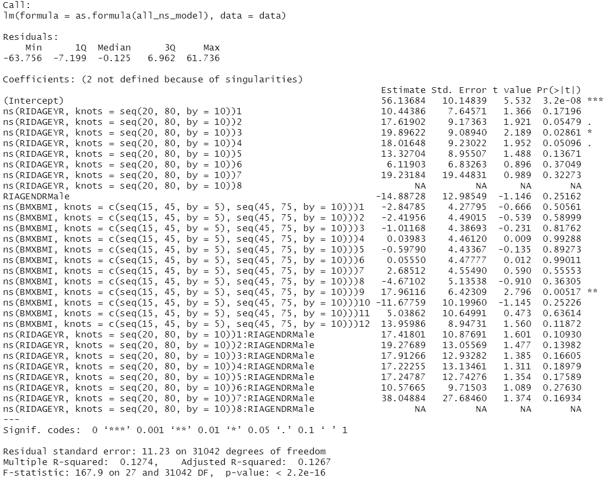
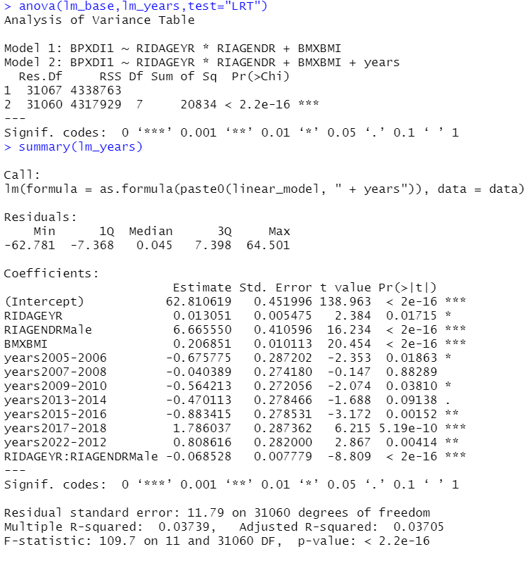

```{r setup, include=FALSE}
knitr::opts_chunk$set(echo = TRUE)
```


## Load libs and Load data
The process of load libs and data is the same as [EnWAS sample](https://ccb-hms.github.io/Imputation/7_enwas/EnWAS_simple.html).

```{r data, warning=FALSE,message=FALSE,echo=FALSE}
# source("../6_nhanes_data/phesant.R")

library(DBI)
# library(broom)
library(splines)
# library(stringr)
library(dplyr)
library(ggplot2)
library(EnWAS)
library(Hmisc)
exposure_vars <-
  read.delim("../../data/select_vars.txt", header = FALSE)$V1
exposure_cols <- paste(exposure_vars, collapse = ", ")


# Load data and convert data types according to PHESEANT.
# Return data set and PHESEANT results.
load_data <- function(exposure_cols) {
  nhanes_db <- dbConnect(RSQLite::SQLite(), "../../nhanes.sqlite")
  
  cols <-
    'SEQN,BMXWAIST, RIDAGEYR, BMXHT, BMXBMI, BMXWT, RIAGENDR,SDMVPSU,SDMVSTRA,RIDRETH1, INDFMPIR, years,'
  data_sql <-
    paste('SELECT', cols, exposure_cols, 'FROM merged_table')
  
  data <- dbGetQuery(nhanes_db, data_sql)
  data <- na.omit(data)
  dbDisconnect(nhanes_db)
  
  data
  
}

nhanes_data <- load_data(exposure_cols) 
data_phs <- phesant(nhanes_data)

data <- data_phs$data
phs_res <- data_phs$data_types

```

## Query Extra data 
This part loads the blood pressure data and merges it with the dietary and demographic data in the above section.

```{r query, echo=TRUE}
nhanes_db <- dbConnect(RSQLite::SQLite(), "../../nhanes.sqlite")
# demo <- dbGetQuery(nhanes_db, "select * from demo")
# cholesterol <- dbGetQuery(nhanes_db, "select * from cholesterol")
# BPXDI2,BPXSY1
blood_pressure <- dbGetQuery(nhanes_db, "select SEQN,BPXDI1,years from blood_pressure where BPXDI1 IS NOT NULL and BPXDI1 <> 0")
dbDisconnect(nhanes_db)
data <- merge(blood_pressure, data, by = c("SEQN",'years'))

```

## Base Model

```{r func3, echo=TRUE,warning=F, out.width = '90%'}
linear_model <- 'BPXDI1 ~ RIDAGEYR*RIAGENDR + BMXBMI'
lm_base <- lm(as.formula(linear_model), data)

all_ns_model <-
  'BPXDI1 ~ ns(RIDAGEYR, knots = seq(20, 80, by = 10)) * RIAGENDR + ns(BMXBMI,knots = c(seq(15, 45, by = 5),seq(45,75,by=10)))'
ns_base <- lm(as.formula(all_ns_model), data)
```

## Bins plot functions


```{r plot_functions, echo=TRUE,warning=FALSE,message=FALSE,results = "asis"}
library(ggpubr)
make_bins <- function(x,y,nbin){
  if (nbin==0)
    nbin <- floor(sqrt(length(x)))
  
  df <-
  data.frame(
    y = y,
    breaks = cut2(x,m=nbin,levels.mean=TRUE)
  )
  df <- df %>% 
  dplyr::group_by(breaks) %>% 
  dplyr::summarize(mean = mean(y),
            std = sd(y)
            ) %>% dplyr::mutate(y_min=mean-std, y_max = mean+std)
  
  df$breaks <- as.numeric(df$breaks)
  
  df

}

plot_bins<- function(x,y,xlab="bin avg",ylab="residuals",title="linear",nbin=300){

  df <- make_bins(x,y,nbin)
  g <- ggplot(df,aes(breaks,mean)) + geom_point() +
  # geom_errorbar(aes(ymin=y_min,ymax=y_max))+
  geom_smooth(aes(breaks,mean),method = "lm", formula = y ~  ns(x, df=7))+
  ylab(ylab) + xlab(xlab) + labs(title = title)

 g

  
}


plot_bins2<- function(df_list,nbin=300,xlab = "Moisture",ylab = "Residuals"){
  df <- do.call("rbind", df_list)
  df$Model <-
  rep(names(df_list), each = nrow(df_list[[1]]))
    
  g <- ggplot(df,aes(breaks,mean,color=Model)) + geom_point() +
  geom_smooth(aes(breaks,mean),method = "lm", formula = y ~  ns(x, df=7))+
    scale_color_manual(values=c("#E69F00", "#56B4E9"))+
  ylab(ylab) + xlab(xlab) +
  theme_minimal()
  g
  
}


```


## BPXDI1 - Diastolic: Blood pres (1st rdg) mm Hg

This section compares linear and spline regression of Diastolic blood pressure against age and BMI.

```{r BPXDI1, echo=TRUE,warning=FALSE}


raw_bmi <- ggplot(data, aes(x=BMXBMI, y=BPXDI1) ) + 
  geom_point(alpha=0.2,shape=1,color="azure4")+
  geom_smooth(method = lm,formula = y ~ ns(x,df=7),aes(color="spline"),show.legend = FALSE)+
  geom_smooth(method = lm, formula = y ~ x,aes(color="linear"),show.legend = FALSE)+
  scale_color_manual(name = "Model",             # legend name
                     values = c("linear" = "#E69F00",  # map regression line colors
                                "spline" = "#56B4E9"))+
  xlab("BMI(kg/m²)") + ylab("Diastolic (0~140 mmHg)")+
  theme_minimal()

raw_age <- ggplot(data, aes(x=RIDAGEYR, y=BPXDI1) ) + 
  geom_point(alpha=0.2,shape=1,color="azure4")+
  geom_smooth(method = lm,formula = y ~ ns(x,df=7),aes(color="spline"))+
  geom_smooth(method = lm, formula = y ~ x,aes(color="linear"))+
  scale_color_manual(name = "Model",             # legend name
                     values = c("linear" = "#E69F00",  # map regression line colors
                                "spline" = "#56B4E9"))+
  xlab("Age (year)") + ylab("Diastolic(0~140 mmHg)")+
  theme_minimal()


df_bmi_res <- list("linear"=make_bins(x=data$BMXBMI,lm_base$residuals,nbin=500),
                "spline"=make_bins(x=data$BMXBMI,y=ns_base$residuals,nbin=500)
                )

df_age_res <- list("linear"=make_bins(x=data$RIDAGEYR,y=lm_base$residual,nbin=500),
                "spline"=make_bins(x=data$RIDAGEYR,y=ns_base$residuals,nbin=500)
                )
bmi_res <- plot_bins2(df_bmi_res,xlab="BMI(kg/m²)")
age_res <- plot_bins2(df_age_res,xlab="Age (year)")

# ggpubr::ggarrange(raw_bmi,raw_age,bmi_res,age_res,common.legend = TRUE,labels = c('a','b','c','d'))


```


As shown in the below plots, the Diastolic has a parabola-like relation with age. The left shows the regressions without raw Diastolic values, and Diastolic values have transformed with inverse normal transformation in the second plot. The linear regression model has a significant residual overall, performing even worse for participants younger than 30 and older than 70.
Therefore, apply linear regression could miss leading in EnWAS.  Similarly, although the spline and linear regressions are very close in this case, they still have some divergence at the early and late age. It may accept to use linear regression on BMI, but spline still would improve the accuracy. Note that the gender does not make much difference in this model.

The residuals of the linear regression against age have an apparent trend (parabola-like shape), and residuals of spline regression have no apparent tendency. In other words, the non-linear relationship was not explained by the the linear regression and was left out in the residuals.


The following plots show the residuals binned and plotted with respect to BMI ($kg/m^2$) and age. 
Each bin contains about 500 data points on average. The number of data points in each could be very different, as we can see from the distributions of the AGE and BMI. As we can see from plots, the residuals from the linear model have a clear trend with age, which indicates the model does not capture the age pattern, whereas the residuals from the spline model have no obvious pattern. Therefore, spline regression (other non-linear functions) is necessary to capture the age trend.


```{r BPXDI12, echo=TRUE,warning=FALSE,out.width = '90%'}
raw_g <- ggpubr::ggarrange(raw_bmi,raw_age,common.legend = TRUE,labels = c('a','b'),legend='right')
res_g <- ggpubr::ggarrange(bmi_res,age_res,common.legend = TRUE,labels = c('c','d'),legend='right')
ggpubr::ggarrange(raw_g,res_g,nrow = 2,ncol = 1)

```

## Summaries of the models







## Plot residuals

```{r enthic, echo=TRUE,results = "asis"}
ethnicity <-
  c(
    'Mexican American',
    'Other Hispanic',
    'Non-Hispanic White',
    'Non-Hispanic Black',
    'Other Race'
  )

# summary(lm_base)


lm_df <-
  data.frame(
    residuals = lm_base$residual,
    ethnicity = data$RIDRETH1,
    gender = data$RIAGENDR,
    years = data$years,
    model = "lm"
  )

# summary(ns_base)
ns_df <-
  data.frame(
    residuals = ns_base$residual,
    ethnicity = data$RIDRETH1,
    gender = data$RIAGENDR,
    years = data$years,
    model = "ns"
  )
levels(ns_df$ethnicity) <- ethnicity

```

## Plot residuals ethnicity and years

The following plot shows the compassion of residuals across ethnic groups. The Non-Hispanic Black and Non-Hispanic White are slightly different from the rest of groups.

```{r enthic2, echo=TRUE,eval=FALSE,results = "asis"}
summary(lm(formula = residuals ~ ethnicity, data = ns_df))

```


## Residual ~ Age

We plotted scatter plots of residuals from the linear regression and spline regression against age to verify the base models. 


```{r resid2_age, echo=TRUE,results = "asis"}
par(mfrow=c(1,2))
smoothScatter(data$RIDAGEYR,lm_base$residuals,
              nrpoints=100,pch = 10, col = "red")
smoothScatter(data$RIDAGEYR,ns_base$residuals,
              nrpoints=100,pch = 10, col = "red")
```


## More Residual Plot


```{r residual12, echo=TRUE,warning=FALSE,message=FALSE,results = "asis",dpi = 200}
age_dist <- ggplot(data=data, aes(x=RIDAGEYR, group=RIAGENDR, fill=RIAGENDR)) +
    geom_density(adjust=1.5, alpha=.25)
bmi_dist <- ggplot(data=data, aes(x=BMXBMI, group=RIAGENDR, fill=RIAGENDR)) +
    geom_density(adjust=1.5, alpha=.25)
ggarrange(age_dist,bmi_dist,common.legend = TRUE)
```


```{r residual122, echo=TRUE,warning=FALSE,message=FALSE,results = "asis",dpi = 200}
lm_bmi <- plot_bins(data$BMXBMI, lm_base$residuals,xlab="BMI(kg/m²)",nbin=300)
ns_bmi <- plot_bins(data$BMXBMI, ns_base$residuals,xlab="BMI(kg/m²)",title="spline",nbin=300)
lm_age <- plot_bins(data$RIDAGEYR, lm_base$residuals,xlab="Age",nbin=300)
ns_age <- plot_bins(data$RIDAGEYR, ns_base$residuals,xlab="Age",title="spline",nbin=300)

ggarrange(lm_age,ns_age,lm_bmi,ns_bmi,ncol = 2,nrow = 2,common.legend = TRUE)

```

## Scale-Location

The following plots show spread points equally (randomly) along the horizontal line, which indicates equal variance (homoscedasticity).

```{r Scale, echo=TRUE,warning=FALSE,message=FALSE,results = "asis"}
par(mfrow=c(1,2))
plot(lm_base, which = 3,main = "Linear")
plot(ns_base, which = 3,main = "Spline")
```


A clear versions of the above plots with bins.

```{r Scale1, echo=TRUE,warning=FALSE,message=FALSE,results = "asis",dpi = 200}
library(latex2exp)
std_g_lm <- plot_bins(
  lm_base$fitted.values,
  sqrt(abs(rstandard(lm_base))),
  xlab = "fitted value",
  ylab = TeX(r'($\sqrt{|standardize\ residuals|}$)'),
  nbin = 200
)
std_g_ns <- plot_bins(
  ns_base$fitted.values,
  sqrt(abs(rstandard(ns_base))),
  xlab = "fitted value",
  ylab = TeX(r'($\sqrt{|standardize\ residuals|}$)'),
  title="spline",
  nbin = 200
)

ggarrange(std_g_lm, std_g_ns,common.legend = TRUE)
```


## Residuals vs Leverage
Leverage for linear regression:
$$
\frac{1}{n}+\frac{\left(X_{i}-\bar{X}\right)^{2}}{S S_{X X}}
$$
Influence: Cook's distance 

As we can see from the lower left corner, some outliers are influential in linear regression.
There are no obvious outliers in the spline regression. 


```{r Leverage, echo=TRUE,warning=FALSE,message=FALSE,results = "asis",dpi = 200}
par(mfrow=c(1,2))
plot(lm_base, which = 5,main = "Linear")
plot(ns_base, which = 5,main = "Spline")

res_g_lv_lm <- plot_bins(
  hatvalues(lm_base),
  lm_base$residuals,
  xlab = "Leverage",
  ylab = "Residuals",
  title="Linear",
  nbin = 500
)
res_g_lv <- plot_bins(
  hatvalues(ns_base),
  ns_base$residuals,
  xlab = "Leverage",
  ylab = "Residuals",
  title="spline",
  nbin = 500
)

ggarrange(res_g_lv_lm, res_g_lv,common.legend = TRUE)
```


Further, we can filter out the outliers defined by their Cook's distance greater than 5 times the mean of Cook's distance.
And we can find that the dataset has a very different distribution from the whole data set. First, most participants are older than 80 and younger than 40. Second, the Diastolic-Blood Pressure distributions are like parabola concave up, whereas the whole data set is like a bell curve distribution (parabola concave down shape).

```{r Leverage2, echo=TRUE,warning=FALSE,message=FALSE,results = "asis",dpi = 200}
lm_cooks_ds <- cooks.distance(lm_base)
lm_influential <- lm_cooks_ds[(lm_cooks_ds > (5 * mean(lm_cooks_ds, na.rm = TRUE)))]

ns_cooks_ds <- cooks.distance(ns_base)
ns_influential <- ns_cooks_ds[(ns_cooks_ds > (5 * mean(ns_cooks_ds, na.rm = TRUE)))]

p_lm <- ggplot(data=data[names(lm_influential),], aes(x=BPXDI1, group=RIAGENDR, fill=RIAGENDR)) +
  geom_density(adjust=1.5, alpha=.25)+labs(title = "linear")
p_lm2 <- ggplot(data=data[names(lm_influential),], aes(x=RIDAGEYR, group=RIAGENDR, fill=RIAGENDR)) +
  geom_density(adjust=1.5, alpha=.25)+labs(title = "linear")
p_ns <- ggplot(data=data[names(ns_influential),], aes(x=BPXDI1, group=RIAGENDR, fill=RIAGENDR)) +
  geom_density(adjust=1.5, alpha=.25)+labs(title = "spline")
p_ns2 <- ggplot(data=data[names(ns_influential),], aes(x=RIDAGEYR, group=RIAGENDR, fill=RIAGENDR)) +
  geom_density(adjust=1.5, alpha=.25)+labs(title = "spline")

ggarrange(p_lm, p_ns,p_lm2,p_ns2,ncol = 2,nrow = 2, common.legend = TRUE)
```

By removing these two outliers from the linear regression, the $R^2$ change from 0.03276 to 0.03449 for linear regression , and 0.1273 to 0.08406 for spline regression

```{r Leverage3, echo=TRUE,warning=FALSE,message=FALSE,results = "asis",dpi = 200}
lm_base1 <- lm(as.formula(linear_model), data[names(lm_influential),])
ns_base1 <- lm(as.formula(all_ns_model), data[names(ns_influential),])
par(mfrow=c(1,2))
plot(lm_base1, which = 5,main = "Linear")
plot(ns_base1, which = 5,main = "Spline")
```

As we can see from the above plot,  the data points are spitted into two groups in the standard deviation plot of the linear regression model. The following plots can further check those data. As Diastolic-Blood Pressure has parabola-like relation with age, the prediction of younger and elderly groups are higher than actual values, leading to negative residuals. The middle age groups produce positive residuals.

```{r std_twog, echo=TRUE,warning=FALSE,message=FALSE,results = "asis",dpi = 200}
std_lm <- rstandard(lm_base1)

geater0 <- std_lm[std_lm>0]
less0 <- std_lm[std_lm<0]

par(mfrow=c(2,2))
hist(data[names(geater0),]$BPXDI1, xlab="Diasatolic (std>0)",main = NULL)
hist(data[names(less0),]$BPXDI1, xlab="Diasatolic (std<0)",main = NULL)
hist(data[names(geater0),]$RIDAGEYR, xlab="Age (std>0)",main = NULL)
hist(data[names(less0),]$RIDAGEYR, xlab="Age (std<0)",main = NULL)
```

###  Cook's distance and leverage bin plots

```{r Leverage4, echo=TRUE,warning=FALSE,message=FALSE,results = "asis",dpi = 200}

lm_cook_age <- plot_bins(
  data$RIDAGEYR,
  cooks.distance(lm_base),
  xlab = "Age",
  ylab = "Cook's Distance",
  nbin = 500
)
ns_cook_age <- plot_bins(
  data$RIDAGEYR,
  cooks.distance(ns_base),
  xlab = "Age",
  ylab = "Cook's Distance",
  title="spline",
  nbin = 500
)


lm_cook_bmi <- plot_bins(
  data$BMXBMI,
  cooks.distance(lm_base),
  xlab = "BMI",
  ylab = "Cook's Distance",
  nbin = 500
)
ns_cook_bmi <- plot_bins(
  data$BMXBMI,
  cooks.distance(ns_base),
  xlab = "BMI",
  ylab = "Cook's Distance",
  title="spline",
  nbin = 500
)

# ggarrange(lm_cook_age,ns_cook_age,lm_cook_bmi,ns_cook_bmi,common.legend = TRUE)

lev_lm_age <- plot_bins(
  data$RIDAGEYR,
  hatvalues(lm_base),
  xlab = "Age",
  ylab = "Leverage",
  nbin = 500
)
lev_ns_age <- plot_bins(
  data$RIDAGEYR,
  hatvalues(ns_base),
  xlab = "Age",
  ylab = "Leverage",
  title="spline",
  nbin = 500
)


lev_lm_bmi <- plot_bins(
  data$BMXBMI,
  hatvalues(lm_base),
  xlab = "BMI",
  ylab = "Leverage",
  nbin = 500
)
lev_ns_bmi <- plot_bins(
  data$BMXBMI,
  hatvalues(ns_base),
  xlab = "BMI",
  ylab = "Leverage",
  title="spline",
  nbin = 500
)


# ggarrange(lev_lm_age, lev_ns_age,lev_lm_bmi,lev_ns_bmi,common.legend = TRUE)


```


As we can see from the bin plots, the participants who are younger ( < 40 ) or older (> 70) have high leverage and influence in the linear regression. On the other hand, the age variable does not have a significant impact on the spline regression model.

However, the data points with BMI above 60 have high leverage and influence in both models because it has much fewer data, as shown in the above plots. As the BMI has a linear relation with Diastolic-Blood Pressure, the data points with BMI less than 20 or greater than 40 have higher leverage and influence in the linear regression than in the spline regression. 

```{r Leverage5, echo=TRUE,warning=FALSE,message=FALSE,results = "asis",dpi = 200}

ggarrange(lm_cook_age,ns_cook_age,lm_cook_bmi,ns_cook_bmi,common.legend = TRUE)

```


```{r Leverage6, echo=TRUE,warning=FALSE,message=FALSE,results = "asis",dpi = 200}

ggarrange(lev_lm_age, lev_ns_age,lev_lm_bmi,lev_ns_bmi,common.legend = TRUE)

```


