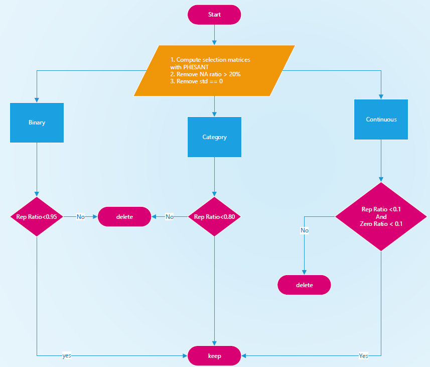

```{r setup, include=FALSE}
knitr::opts_chunk$set(echo = TRUE)
```

## load libs
```{r libs,warning=FALSE,message=FALSE}
library(splines)
library(stringr)
library(dplyr)
library(ggplot2)
library(gridExtra)
library(DBI)
```

## Load exploration
- `nhanes.sqlite` can download [here](https://github.com/ccb-hms/Imputation/blob/main/nhanes.sqlite) or generate by run [notebook](https://ccb-hms.github.io/Imputation/nhanes_exploratory.html)

```{r data, echo=TRUE}
nhanes_db <- dbConnect(RSQLite::SQLite(), "nhanes.sqlite")

# list all of the tables
dbListTables(nhanes_db)

temp_data <-
  dbGetQuery(nhanes_db, "select * from diet_total limit 1")
data <- dbGetQuery(nhanes_db, "select * from merged_table")
dbDisconnect(nhanes_db)

diet_cols <- intersect(colnames(temp_data), colnames(data))
diet_cols <- diet_cols[!diet_cols %in% c('SEQN', 'years')]

diet_data <- data[, diet_cols]

```

## define functions

```{r func, echo=TRUE}
invNorm <- function(x) {qnorm((rank(x) - 3/8)/(length(x) +1 - 6/8))}
source("phesant.R")

# generate the variable selection metrices
select_matrice <- function(df){
  select_df <- data.frame(
    
    # mean
    mean = colMeans(df,na.rm=TRUE),
    
    # max value
    max = sapply(df, function(x) max(x,na.rm=TRUE)),
    # min value
    min = sapply(df, function(x) min(x,na.rm=TRUE)),
    # Standard Deviation
    std = round(sapply(df, function(x) sd(x,na.rm=TRUE)),4),
    # number of distinct values
    distinct_n = sapply(df, function(x) length(unique(x))),
    # most frequency value
    freq_val =  sapply(df, function(x) names(which.max(table(x)))),
    # biggest repetitive number
    rept_n = sapply(df, function(x) max(table(x))),
  
    # number of NAs
    na_n = sapply(df, function(x) sum(is.na(x))),

    # number of 0
    zero_n = sapply(df, function(x) sum(na.omit(x)==0)),

    # phesant
    phesant = phesant(df)
    
  )
    # repetitive ratio
    select_df$rept_ratio <- round(select_df$rept_n/nrow(df),4)
    # zero ratio
    select_df$zero_ratio <- round(select_df$zero_n/nrow(df),4)
  
  select_df
}

```


## Selection process


```{r func2, echo=TRUE,warning=FALSE}
library(knitr)
select_df <- select_matrice(diet_data)
kable(head(select_df))
select_vars <- select_df |> filter((phesant != 'binary' & rept_ratio < 0.5) |
                                     (phesant == 'binary' & rept_ratio < 0.7)) |>
              filter(!(phesant=='continuous' & rept_ratio > 0.1 & zero_ratio > 0.1)) 

select_vars <- rownames(select_vars)

select_vars
```

## Removed variables

```{r func31, echo=TRUE,warning=FALSE}
discard_varible <- setdiff(colnames(diet_data),select_vars)
#discard variables
kable(select_df[discard_varible,])
```

## final selected varibles

Although the above process selected variables with reasonable distribution, some of the variables rather overlap.
We can view the official documents on [NHANES](https://wwwn.cdc.gov/Nchs/Nhanes/2017-2018/DR1TOT_J.htm) or [look up varibles tool](https://ccb-hms.github.io/Imputation/check_vars.html).

For example, we may just need keep one of:

- DR1TS040 - SFA 4:0 (Butanoic) (gm)
- DR1TS060 - SFA 6:0 (Hexanoic) (gm)
- DR1TS080 - SFA 8:0 (Octanoic) (gm)
- DR1TS100 - SFA 10:0 (Decanoic) (gm)
- DR1TS120 - SFA 12:0 (Dodecanoic) (gm)
- DR1TS140 - SFA 14:0 (Tetradecanoic) (gm)
- DR1TS160 - SFA 16:0 (Hexadecanoic) (gm)
- DR1TS180 - SFA 18:0 (Octadecanoic) (gm)

one of:

- DR1TP182 - PFA 18:2 (Octadecadienoic) (gm)
- DR1TP183 - PFA 18:3 (Octadecatrienoic) (gm)
- DR1TP204 - PFA 20:4 (Eicosatetraenoic) (gm)

one of:

- DR1TM161 - MFA 16:1 (Hexadecenoic) (gm)
- DR1TM181 - MFA 18:1 (Octadecenoic) (gm)
- DR1TM201 - MFA 20:1 (Eicosenoic) (gm)


## Correlation Matrix

```{r func411, echo=TRUE,warning=FALSE}
library(corrplot)

diet_data <- data[, c('RIAGENDR', diet_cols)]
sfa_data <- na.omit(diet_data[, c(
  "DR1TS040",
  "DR1TS060",
  'DR1TS080',
  "DR1TS100",
  'DR1TS120',
  "DR1TS140",
  "DR1TS160",
  "DR1TS180"
)])
sfa_cor <- cor(sfa_data)

kable(sfa_cor)
heatmap(sfa_cor)
corrplot(sfa_cor,
         type = "upper",
         order = "hclust",
         tl.srt = 45)


pfa_data <- na.omit(diet_data[, c('DR1TP182', 'DR1TP183', 'DR1TP204')])
cor(pfa_data)

mfa_data <- na.omit(diet_data[, c('DR1TM161', 'DR1TM181', 'DR1TM201')])
cor(mfa_data)

```


## PCA Analysis

```{r func412, echo=TRUE,warning=FALSE}
library(ggfortify)


sfa_data <-
  na.omit(diet_data[, c(
    "RIAGENDR",
    "DR1TS040",
    "DR1TS060",
    'DR1TS080',
    "DR1TS100",
    'DR1TS120',
    "DR1TS140",
    "DR1TS160",
    "DR1TS180"
  )])

sfa_pca <- prcomp(sfa_data[, 2:8],
                  center = TRUE, scale. = TRUE)

autoplot(
  sfa_pca,
  data = sfa_data,
  colour = 'RIAGENDR',
  loadings = TRUE,
  loadings.colour = 'blue',
  loadings.label = TRUE,
  loadings.label.size = 3,
  alpha = 0.1
)


pfa_data <-
  na.omit(diet_data[, c("RIAGENDR", 'DR1TP182', 'DR1TP183', 'DR1TP204')])

pfa_pca <- prcomp(pfa_data[, 2:4],
                  center = TRUE, scale. = TRUE)

autoplot(
  pfa_pca,
  data = sfa_data,
  colour = 'RIAGENDR',
  loadings = TRUE,
  loadings.colour = 'blue',
  loadings.label = TRUE,
  loadings.label.size = 3,
  alpha = 0.1
)


mfa_data <-
  na.omit(diet_data[, c("RIAGENDR", 'DR1TM161', 'DR1TM181', 'DR1TM201')])

mfa_pca <- prcomp(mfa_data[, 2:4],
                  center = TRUE, scale. = TRUE)

autoplot(
  mfa_pca,
  data = sfa_data,
  colour = 'RIAGENDR',
  loadings = TRUE,
  loadings.colour = 'blue',
  loadings.label = TRUE,
  loadings.label.size = 3,
  alpha = 0.1
)

```


```{r func4, echo=TRUE,warning=FALSE}
select_vars <- select_vars[!(select_vars %in% c('DR1TM181','DR1TM201','DR1TP182',
                                                'DR1TS040','DR1TS060','DR1TS080',
                                                'DR1TS100','DR1TS120','DR1TS140',
                                                'DR1TS160','DR1TS180','DR1TP204',
                                                'DR1TP182'))]

select_vars

write(select_vars, "data/select_vars.txt")

# we can read them varibles later by
# selected_cols <- read.delim("data/select_vars.txt",header = FALSE)$V1
```


